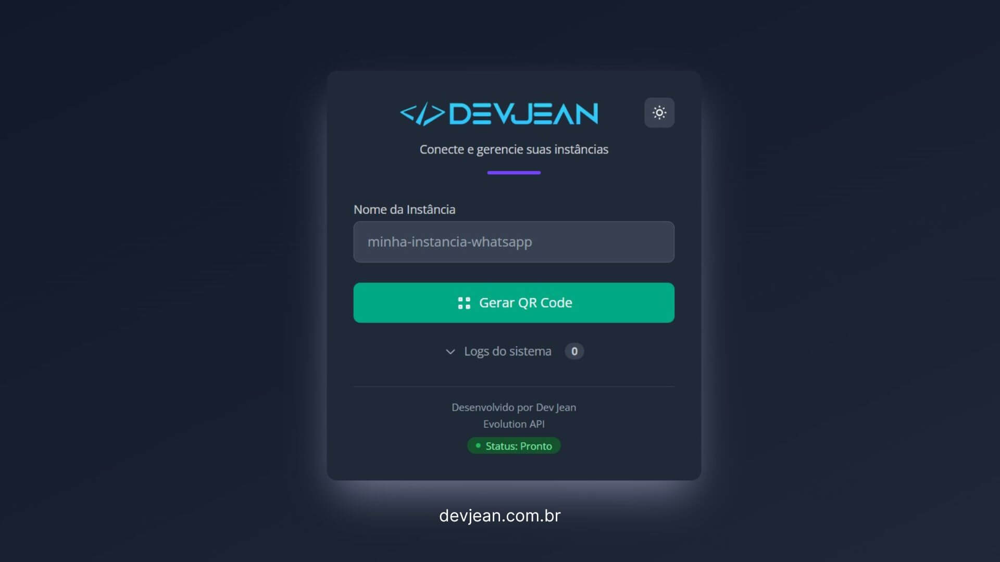

# 🔌 Conector Gratuito para Evolution API

Um conector front-end gratuito e de código aberto para a **[Evolution API](https://www.google.com/search?q=https://github.com/evolution-api/evolution-api)**, projetado para facilitar a conexão e o gerenciamento de instâncias do WhatsApp de forma simples e intuitiva.

Este projeto é uma forma de contribuir com a incrível comunidade que utiliza **Evolution API**, **[n8n](https://n8n.io/)** e **[Chatwoot](https://www.chatwoot.com/)**, oferecendo uma interface limpa e funcional que pode ser facilmente integrada em diversas plataformas de automação.

**Desenvolvido por [Dev Jean](https://devjean.com.br/)**



## ✨ Funcionalidades Principais

  * **📱 Conexão via QR Code**: Gera e exibe o QR Code para conectar uma nova instância do WhatsApp.
  * **📶 Status em Tempo Real**: Verifica e exibe o status da conexão (Aguardando, Conectado, Desconectado).
  * **👤 Visualização de Perfil**: Mostra a foto, nome e número do perfil conectado.
  * **⚙️ Gerenciamento da Instância**:
      * **Reiniciar**: Reinicia a conexão da instância.
      * **Desconectar**: Faz o logout e retorna à tela inicial.
      * **Atualizar**: Busca novamente as informações do perfil.
  * **🎨 Interface Moderna**:
      * Tema claro e escuro (com seletor manual e detecção automática do sistema).
      * Design responsivo que se adapta a desktops e celulares.
      * Logs do sistema para acompanhar o processo de conexão.
  * **🔗 Fácil Integração**: Projetado para uso com **n8n**, recebendo variáveis de forma dinâmica para personalização total.

-----

### ⭐ Procurando uma Solução Completa?

Se você precisa de recursos avançados, como gerenciamento de comportamento de instâncias, criação de novas instâncias, configuração de proxy e criação automática de caixas de entrada no Chatwoot, conheça o **[Conector WaCorps](https://github.com/jeankrausejean/WaCorps-Conector-Readme)**.

-----

## 🚀 Guia de Instalação

Você pode instalar o conector de duas formas, dependendo da sua necessidade.

### Opção 1: Instalação com n8n (Recomendado)

Este método é o mais prático, pois utiliza um workflow pronto para servir o conector como uma página web, facilitando a personalização através de um formulário. O arquivo necessário está na pasta `conector para n8n`.

1.  **Download do Workflow**: Baixe o arquivo de workflow pronto para uso [clicando aqui](https://www.google.com/search?q=Conector/conector_devjean.json).
2.  **Importe no n8n**: Em seu painel do n8n, vá em `New` \> `Import from file...` e selecione o arquivo `.json` que você baixou.
3.  **Personalize as Variáveis**: No workflow importado, abra o nó **"Personalização"** e preencha os campos com os dados da sua API e os links para seus logos.
4.  **Ative e Acesse**: Salve e ative o workflow. Copie a URL de produção do Webhook e cole no seu navegador. Você também pode inseri-la no seu Chatwoot como um App de Dashboard.

#### Tabela de Variáveis (nó "Personalização")

| Variável | Descrição | Exemplo |
| :--- | :--- | :--- |
| `urlApi` | A URL base da sua instância da Evolution API. | `https://api.meudominio.com` |
| `apikey` | A `globalApiKey` da sua instância da Evolution API. | `SuaChaveSuperSecreta` |
| `logo_light` | URL para a imagem do seu logo no modo claro. | `https://site.com/logo-claro.svg` |
| `alt_tex_light` | Texto alternativo para o logo no modo claro. | `Logo da Minha Empresa` |
| `logo_dark` | URL para a imagem do seu logo no modo escuro. | `https://site.com/logo-escuro.svg` |
| `alt_text_dark` | Texto alternativo para o logo no modo escuro. | `Logo da Minha Empresa` |

-----

### Opção 2: Instalação em Hospedagem (VPS, Compartilhada, etc.)

Este método é ideal para quem deseja hospedar o arquivo HTML diretamente em um servidor web. O arquivo necessário está na pasta `conector para hospedagem`.

1.  **Faça o Upload**: Envie o arquivo `index.html` da pasta `conector para hospedagem` para o seu servidor.

2.  **Edite o Arquivo**: Abra o arquivo `index.html` em um editor de texto e modifique as seguintes linhas para configurar suas informações:

      * **Linhas 53 e 54**: Altere os links (`src`) para os seus logos (claro e escuro) e o texto alternativo (`alt`).

        ```html
        
        
        ```

      * **Linha 205**: Informe a URL base da sua Evolution API.

        ```javascript
        // Linha 205
        const evolutionUrl = 'SUA_EVOLUTION_BASE_URL'; 
        ```

      * **Linha 206**: Informe a sua Chave de API Global (`globalApiKey`).

        ```javascript
        // Linha 206
        const apiKey = 'SUA_GLOBAL_API_KEY';
        ```


## 🛠️ Tecnologias Utilizadas

  * **HTML5**
  * **Tailwind CSS** (via CDN)
  * **JavaScript** (Vanilla JS)
  * **qrcode.js** (via CDN)

## 👤 Autor

  * **Jean Krause (Dev Jean)**
  * **Site**: [devjean.com.br](https://devjean.com.br/)
  * **GitHub**: [@jeankrausejean](https://github.com/jeankrausejean)

-----

### ⭐ Procurando uma Solução Completa?

Se você precisa de recursos avançados, como gerenciamento de comportamento de instâncias, criação de novas instâncias, configuração de proxy e criação automática de caixas de entrada no Chatwoot, conheça o **[Conector WaCorps](https://github.com/jeankrausejean/WaCorps-Conector-Readme)**.

-----

## 📄 Licença

Este projeto é distribuído sob a licença MIT. Veja o arquivo `LICENSE` para mais detalhes. Sinta-se à vontade para usar, modificar e distribuir.
